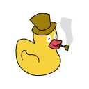

<table>
    <td>
        
    </td>
    <td>
        <h1>Pete - An OMTP Library</h1>
        
        
        
        
        
        
    </td>
</table>

## How to Use

To use Pete, just download the code from github and include it in your project. From there, you can run any of the functions inside of the codebase. At the moment, not all of the functions have Javadoc comments on them, but most of them do. If you choose to use pete, we would love it if you could show the project some love and contribute or try to fund the project. Also, if you could mention that you used pete to build your app or project, that would be great (since were under the MIT license, your not required to mention us at all).

## Features

### Endpoint-Based Server

### Response Codes

### Request and Response Parser

## License

Copyright 2021 William McGonagle

Permission is hereby granted, free of charge, to any person obtaining a copy of this software and associated documentation files (the "Software"), to deal in the Software without restriction, including without limitation the rights to use, copy, modify, merge, publish, distribute, sublicense, and/or sell copies of the Software, and to permit persons to whom the Software is furnished to do so, subject to the following conditions:

The above copyright notice and this permission notice shall be included in all copies or substantial portions of the Software.

The software is provided "as is", without warranty of any kind, express or implied, including but not limited to the warranties of merchantability, fitness for a particular purpose and noninfringement. In no event shall the authors or copyright holders be liable for any claim, damages or other liability, whether in an action of contract, tort or otherwise, arising from, out of or in connection with the software or the use or other dealings in the software.
